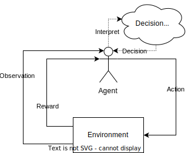

+++
title = "Introduction to Reinforcement Learning"
description = "An overview of reinforcement learning"
[extra]
allow_comments = true
+++

This blog post will go over a simple **high level** introduction to reinforcement learning. 
I will focus on providing some major terms and explaining the common ideas for any reinforcement learning setup.
My goal is to provide a good jumping off point for further research. 
Also, this is meant to be language and software agnostic, but I will provide some resources for a couple of concrete implementations towards the end of the post. 
<!-- more -->

## What is Reinforcement Learning?

is a kind of machine learning strategy/paradigm where one trains an intelligent agent using a reward structure. 
The agent makes decisions based on what it observes and takes actions based on what it believes will maximize the total rewards.
 
*Note: Despite the name "rewards", rewards can be either positive or **negative**.* 
Agents under this learning system usually operate in a simulated environment where there are no exact actions that produce the best outcome but there is a predefined goal to reach. 
It is up to the agent to figure out how best to accomplish the task using the rewards given during each training episode.

### Comparison
Reinforcement learning can be contrasted with the other two main strategies of machine learning: Supervised Learning and Unsupervised Learning. 


| *Type of Learning*      | **Reinforcement Learning**              | Supervised Learning         | Unsupervised Learning                             |
|:----------------------- |:---------------------------------------:|:---------------------------:|:-------------------------------------------------:|
| *Input Data*            | Gathered from sensors                   | Taken from Labelled Dataset | Taken from Unlabelled Dataset                     |
| *Output Data*           | Set of Action                           | Predicted Label             | Self-determined Labels                            |
| *Mechanism of Learning* | Reward Optimization                     | Optimize Expected Label     | Optimize Closeness to Dataset                     |
| *Approaches*            | Q-Learning, Proximal Policy Optimization| Classification, Regression  | Clustering, Association, Dimensionality Reduction |
| *Task Example*          | Learning to navigate an obstacle course | Check if email is spam      | Make a recommendation based on person's interests |
| *Human Example*         | Playing video games                     | School Exams                | Young child categorizing different animals        |


*Note: Despite the strategies being described separately, they are often used together. 
For instance, a subclass of Reinforcement Learning is Behavior Imitation, in which the agent learns both the behavior to imitate (via Supervised Learning) and which actions the policy finds to be the best (via Reinforcement Learning)
Another instance is Semi-Supervised Learning, which brings together aspects of Supervised learning and Unsupervised learning.*

## Overview of Reinforcement Learning
Reinforcement learning splits the world into two main parts. The first is the environment, which is essentially the abstract world of the simulation. 
The environment is made up of many different states, which may or may not dynamically change by itself. 
The environment is meant to be a simple and specific reconstruction of a more complex (real-world) system. 
This reduction of the world space allows one to control what is important to learn and can speed up training, as there are fewer distractions inside the environment.

The second part is the agent, which is an entity that exists within the environment capable of making decisions. 
The agent is able to take in information from the environment, interpret that to make a decision, then do something in/to the environment, and then get some sort of reward.
This builds the backbone of how the agent operates inside the environment and what it learns with this can be translated to more real world tasks.





Let's walk through the loop. 
The loop start with the environment in some particular state. 
In order for the agent to determine the state, it needs to **observe** the state, usually with some kind of sensor. 
The observation becomes the input data to the decision maker and the decision maker outputs a decision based on a specific policy it follows. 
The decision is translated to an **action**, often implement with actuators, that may or may not change the state of the environment. 
When an action is taken, there may also be a **reward** attached to the state change, which provides feedback to the agent. 
The loop starts over again with the next state.

This loop runs every "turn" during an episode. An episode can be thought of as a single simulated run from start to end. 
During each training episode, the agent focuses on exploring the action space to see what yields the highest reward. 
This allows the agent to get the widest set of data to work from when developing it's strategy. 
On a testing episode, the agent will use the best-found strategy to solve the task. 

Generally, the agent includes the sensors, decision maker, and actuators in a single entity, but it may be possible to split them apart into different entities (for example, [Alpha Go](https://towardsdatascience.com/understanding-alphago-how-ai-think-and-learn-1-2-da07d3ec5278) is just the decision maker that was trained in a simulated environment, but it requires a camera to see the real-world game board and a human player to play it pieces). 
Also, while any kind of artificial intelligence model may be used for reinforcement learning, there is currently a focus on using neural networks for the decision making process. 
This form of reinforcement learning is called deep reinforcement learning.

### Applications
There are a variety of use cases for reinforcement learning. 
One is autonomous vehicle navigation (or more simply **self-driving** capabilities). 
Using cars as an example, different companies trained their vehicles to navigate a road environment, using sensors such as cameras and LIDAR system and actuators that allow pressing accelerator/gas pedal and controlling the steering wheels. 
Another is Natural Language Processing (<abbr title="Natural Language Processing">NLP</abbr>) applications such as [ChatGPT](https://openai.com/blog/chatgpt). 
These models are trained on a vast corpus of human produced text and use reinforcement learning to produce more natural dialogue responses.
One other is social media recommendation engines, which try to learn habits of the user and try to provide the best content to serve. 
For example, YouTube's algorithm (based on current anecdotal trends) prioritize watch time.
In order for an agent to get a reward, it will try to find the best video(s) to have the user watch and engage with, which increases the time spent on the site.

## Resources

Below are some resources for developing, training, and using Reinforcement Learning agents. 
*Note, I have primarily worked with RL agents using Python and Unity, so I am biased toward those technologies.*  
If you have any other resources to contribute, please let us all know in the comments section.

### Frameworks
* [Gymnasium](https://github.com/Farama-Foundation/Gymnasium)(successor to [OpenAI's Gym](https://github.com/openai/gym))
* [Project Malmo from Microsoft](https://github.com/microsoft/malmo)
* [Unity](https://unity.com/products/machine-learning-agents) and the [ML-Agents package](https://github.com/Unity-Technologies/ml-agents)

### References
* <https://github.com/kengz/awesome-deep-rl>: A curated list of awesome Deep Reinforcement Learning resources.
* [Unsupervised Learning Definition on DeepAI by Thomas Wood](https://deepai.org/machine-learning-glossary-and-terms/unsupervised-learning)
* IBM Posts on Machine Learning Topics:
    * [What is machine learning?](https://www.ibm.com/topics/machine-learning)
    * [What is deep learning?](https://www.ibm.com/topics/deep-learning)
    * [What is unsupervised learning?](https://www.ibm.com/topics/unsupervised-learning)
* [Self-driving Cars: The technology, risks and possibilities](https://sitn.hms.harvard.edu/flash/2017/self-driving-cars-technology-risks-possibilities/)