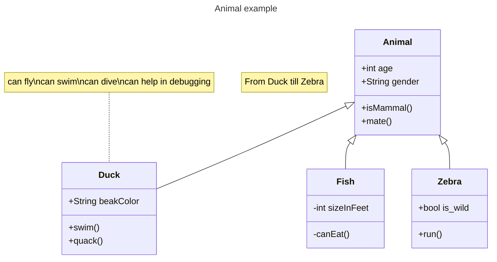

+++
title = "Makrdown Test"
date = 2022-12-29
updated = 2023-02-01

[extra]
allow_comments = true
render_mermaid = true
+++
# Heading 1 with \#

Heading 1 with underline
=========================

## Heading 2 with \#

Heading 2 with underline
------------------------

### Heading 3
#### Heading 4
##### Heading 5
###### Heading 6


This is a paragraph

> This is a
> block quote

`This is an inline code`

```
This is a
fenced
code 
block
```
---
Hyphens for horizontal lines

* List Item using asterisk
+ List Item using plus sign
- List Item using hyphen

1. Ordered List with numbers
2. Second item
1. Number order optional

[Inline link](https://example.com "Example Site")
[Referenced Link with explicit name][Note1]
[Referenced Link with implicit name][]

___ 
Underscore for horizontal line

Here's a sentence with a footnote. [^1]

*single asterisks*

_single underscores_

**double asterisks**

__double underscores__

~~Two tildes.~~

| Left      | Center | Right     |
| :---        |    :----:   |          ---: |
| Header      | Title       | Here's this   |
| Paragraph   | Text        | And more      |


- [x] Completed Task list
- [ ] Uncomplete Task list


[Note1]: https://youtube.com "Youtube"
[referenced link with implicit name]: https://youtube.com "Youtube Again"

***
Asterisk for horizontal lines

# Extra stuff (rendered when needed)



[^1]: This is the footnote.