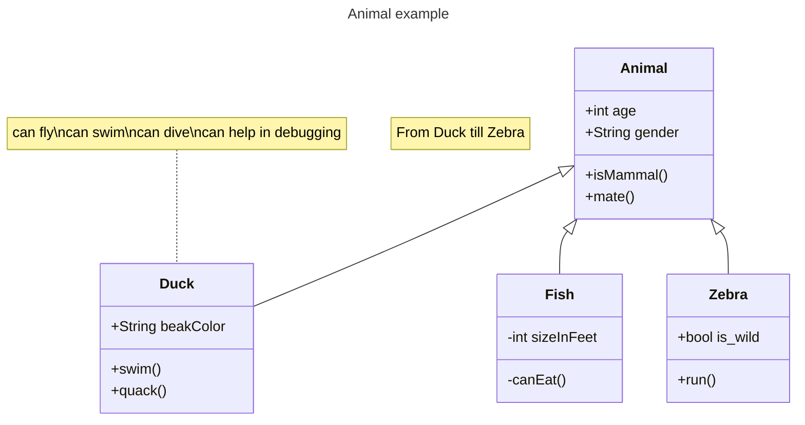

+++
title = "Markdown Test"
date = 2022-12-29
updated = 2023-02-07
draft=true

[extra]
allow_comments = true
render_mermaid = true
+++

> **NOTE:**  
> *This only focuses on content items, see these other pages for other Markdown/HTML/CSS testing:*
> - [Heading](@/test/heading.md)
> - [Color](@/test/colors.md)
> - [Forms](@/test/form.md)

---
[^thematic-break]

This is a paragraph, just regular text with no more than 3 indentation. 

Paragraph ends with 2+ newlines or two spaces after.

> This is a
> block quote

`This is an inline code`

        First line (more indented)
            blank line before not included
    This is an 
        indented 
        code 
        block
    using either spaces or tabs 
        minimum 4 required
            preceding spaces removed
            but interior spaces kept
    blank line after not included

```
This is a
    fenced
    code 
    block
using "`" (backtick)
blank line before and after not required
```
~~~
This is a
    fenced
    code 
    block
using "~" (tilde)
~~~

~~~python
# This is python syntax highlighting
class A:
    def hello(a: int) -> string:
        print("he" + "ll" * a + "o" * a * 1.5)

a = A()

a.hello()
~~~

* List Item using asterisk
+ List Item using plus sign
- List Item using hyphen

1. Ordered List with numbers
2. Second item
1. Number order optional

[Inline link](https://example.com "Example Site")
[Referenced Link with explicit name][Note1]
[Referenced Link with implicit name][]

Here's a sentence with a footnote. [^1]

*single asterisks*

_single underscores_

**double asterisks**

__double underscores__

___ 
[^thematic-break]

~~Two tildes.~~

| Left      | Center | Right     |
| :---        |    :----:   |          ---: |
| Header      | Title       | Here's this   |
| Paragraph   | Text        | And more      |


- [x] Completed Task list
- [ ] Uncomplete Task list


[Note1]: https://youtube.com "Youtube"
[referenced link with implicit name]: https://youtube.com "Youtube Again"


***
[^thematic-break]



[^thematic-break]: This is a horizontal line.

[^1]: This is the footnote.